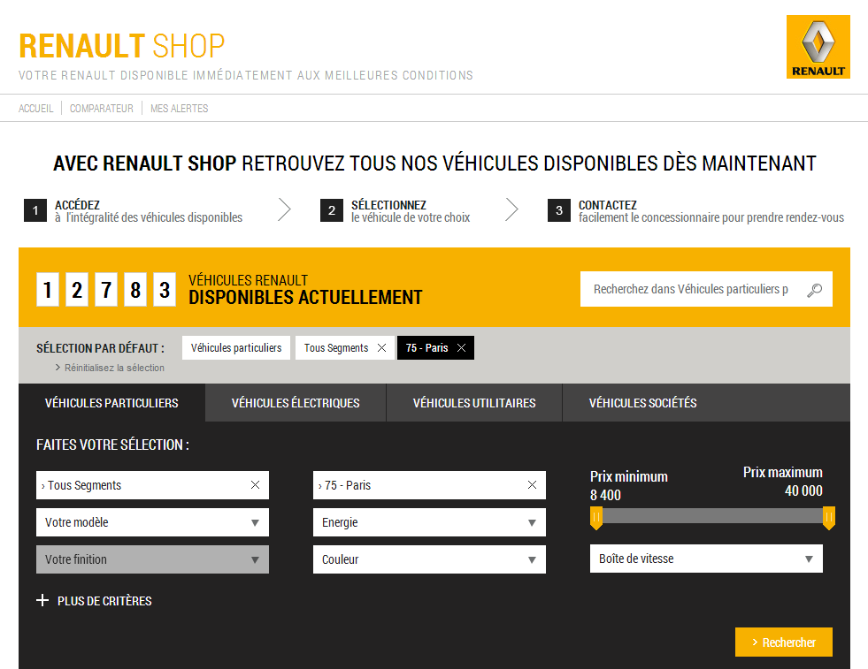

!SLIDE ============================

!SLIDE subsection ======================

# couche présentation

!SLIDE  ======================

# côté client

!SLIDE bullets ======================

# Avantages

* architecture plus simple
* serveur(s) REST stateless
* support de différents clients
    * web
    * mobiles
* montée en charge simplifiée

!SLIDE  ======================

# en JavaScript natif
## et peu de code

!SLIDE bullets ======================

# Avantages

* pas de plugin
* debug natif
* plate-forme HTML étendue

!SLIDE subsection ======================

!SLIDE bullets ======================

# Pourquoi ?

* framework léger
* sans dépendances
* Phonegap

!SLIDE subsection ======================

# SEO

!SLIDE bullets ======================

# Quels sites ?

* applications publiques
* e-commerce
* CMS

!SLIDE ======================

# pages HTML
# générées côté serveur

!SLIDE bullets ======================

# HTML généré côté serveur

* pour les crawlers
* juste les données
* sans mise en page
* sans style

!SLIDE ======================

# pas d'AngularJS
# côté serveur

!SLIDE subsection ======================

!SLIDE ======================

# peu d'applications en production

!SLIDE ======================

!SLIDE ======================

!SLIDE ======================

# peu d'évolutions

!SLIDE bullets ======================

# v 1.0 : version stable

* quelques corrections de bugs

!SLIDE bullets ======================

# v 1.1 : version lab

* animations

!SLIDE bullets ======================

# v 1.2 : release candidate

* animations
* Protractor
    * framework de tests E2E
    * WebDriverJS, Selenium Server

!SLIDE subsection ======================

# le futur

!SLIDE bullets ======================

# Web Components

* Templates
* Shadow DOM
* Custom Elements
* MutationObserver
* Object.observe()

!SLIDE ======================

## convergence avec
# Polymer.js

!SLIDE bullets ======================

# Polymer.js

* AngularJS s'appuiera sur Polymer.js
    * comme il s'appuie sur jQuery
* support natif sur les navigateurs récents
* ou polyfills sur les anciens

!SLIDE subsection ======================

# en version 2.0 ?

!SLIDE ======================

# abandon de IE8

